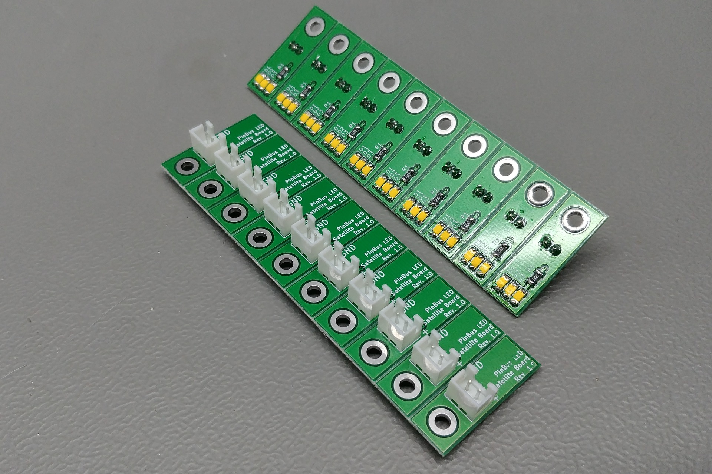

# 1206 LED Satellite Board - Rev. 1.0

This board is designed for three 1206 SMD LEDs. It can be used with the [TLC5940 LED Driver Board](https://github.com/PinBus/TLC5940_LED_driver_board). The LEDs are connected in series.

Replace the 0Ω resistor R0 when not using a LED driver IC. You can use any colour of LED for D1, D2, and D3.

**Warning: These designs are made as part of a hobby project and thus come with no guarantees. Do not use these designs in for any critical systems! Working with voltages higher than +40V can be potentially dangerous, please take appropriate safety measures!**

## BOM

| Identifiers | Quantity | Part |
| ----------- | -------- | ---- |
| J1          |       1x | JST XH connector, 2.5mm pitch, 2-way, through hole |
| R1          |       1x | 1206 SMD 0Ω resistor |
| D1, D2, D3  |       3x | 1206 SMD LED |

## Pictures

